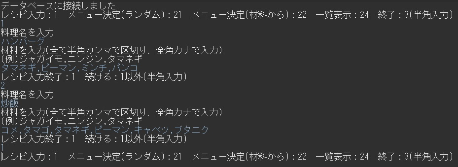
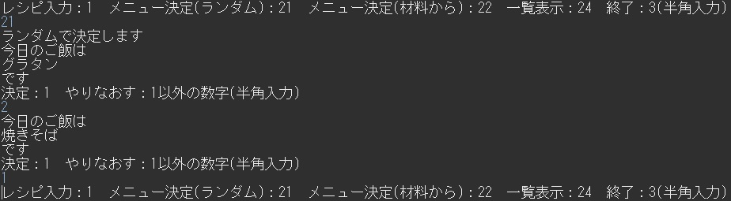
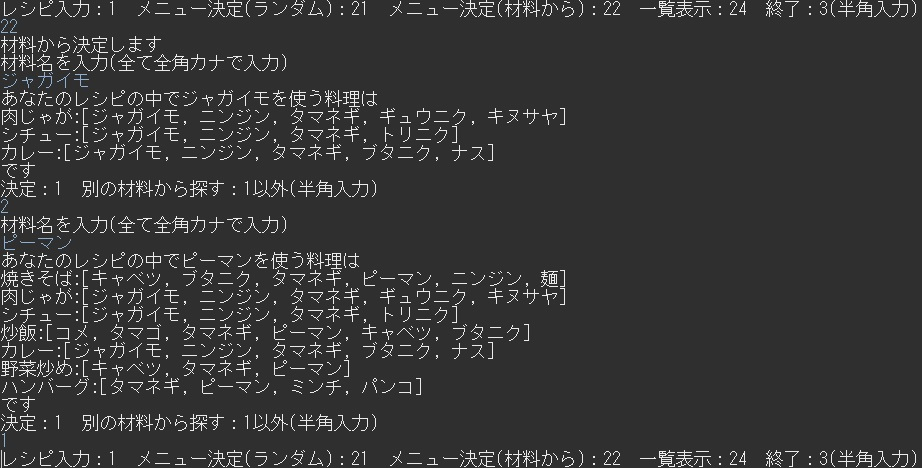
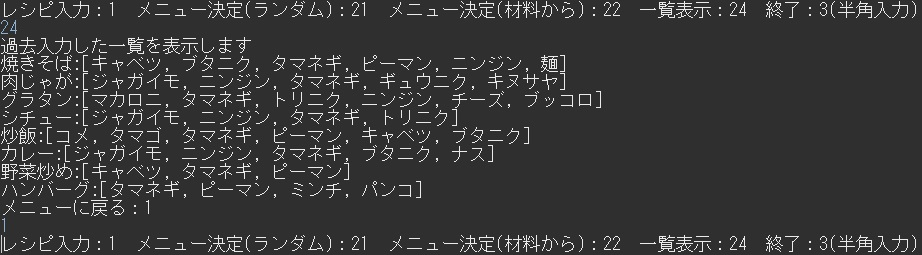

  
# ご覧いただきありがとうございます！  
ポートフォリオとして作成しました「ランダムレシピ」のコードになります。  
料理のレシピを入力して自分のみのレシピ集を作り、そこからランダムでレシピを出力したり、材料からレシピを出力したりするシステムです。  
拙いコードにはなりますが、ご覧になっていただけると幸いです。  
実際動いている状態はこのREAD MEに画像として添付させていたただいております。  
コードをご覧いただく際は、→→とご覧いただくとスムーズかと存じます。  

## 環境  
xampp phpmyadmin 5.2.0(DB)  
java eclipse java17
  
# 実行画面  
  
## 自分が作れるレシピを入力  
  
  
#### 自分が作れるレシピを入力→DBへ保存  
この時、後々完全一致させる為に入力文字を統一しなければなりません。  
その為全角カナの入力を注意書きしております。  
しかし、例えば「じゃがいも」は「ジャガイモ」「じゃが芋」とは打たない！というならば「じゃがいも」と入力しても大丈夫です。  
  
  
## 今まで入力してきたレシピをランダムで出力  
  
  
#### ランダムで数字を出力→DBに保存してあるid(入力番号)と一致するものを出力   
  
  
## 今まで入力してきたレシピの中から該当する材料を使ったレシピを出力  
  
  
#### 使いたい材料名を入力→DBに保存してあるmaterialと一致するものを出力  
  
  
## 今まで入力してきたレシピ一覧を出力  
  
  
### DBに保存してあるレコードをすべて出力  
  
  
実行画面は以上になります。  
ご覧いただきありがとうございました。  
  
## このポートフォリオを作成した理由  
自分の体験から、ごはんを作るときに「なんでもいい」と言われるのが嫌だったり、  
家にある材料から何が作れるのかすぐ分かるようにしたかったからです。  
  
## 苦労した点  
色々な記述を試してもDBに繋がらなかった事です(後々記述方法が間違っていたことに気付きました)  
また、苦労とは少し違いますが、自分で一からシステムを組み上げるにあたり、頭の中にある理想をどうコードに落とし込むか悩みました。  
結果何度もコードを書き直す事に時間が掛かってしまいました。  
改善として、まず先にシステムがどう動くべきなのかを書き出して、それに沿ってコードを記述していく方法を今後は取っていきます。  
  
現在、家にある各材料数入力→料理に使う材料数もレシピで入力→差し引き→残量数を出す  
というシステムも組み込もうと、コード作成中です。  

### 最後までご覧いただきまして誠にありがとうございます。  

